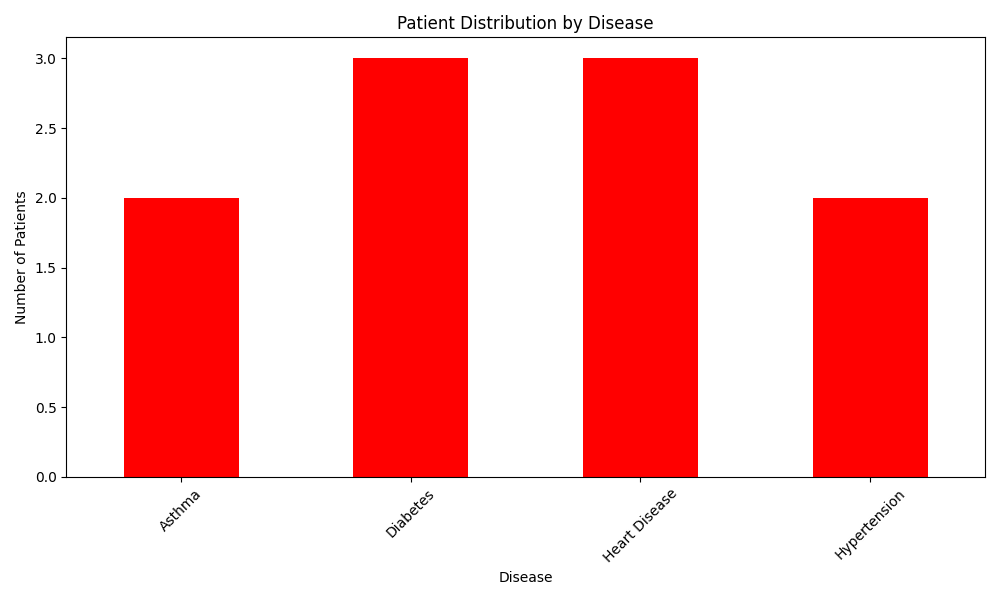
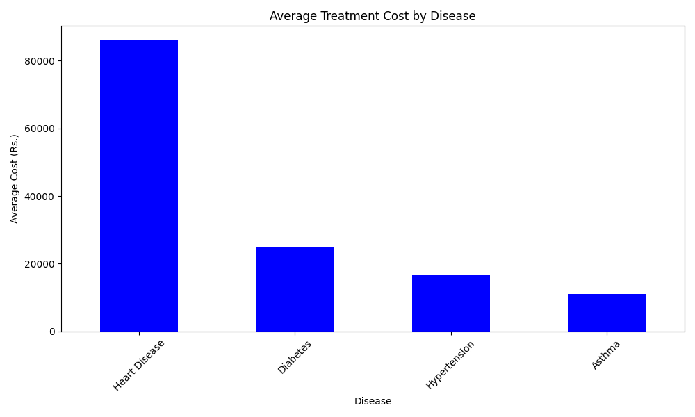

# Hospital Patient Records — Database and Analytics

A database-driven project that stores, manages and analyses hospital patient records using SQLite and Python.

---

## Overview

Real hospital systems run on databases, not spreadsheets. This project simulates that — designing a patient records database from scratch, populating it with data, and running SQL queries to extract meaningful insights about disease patterns and treatment costs.

Built as part of an ongoing data science learning journey.

---

## What It Analyses

| Metric | Result |
|--------|--------|
| Total patients | 10 |
| Total hospital revenue | Rs. 3,88,000 |
| Average treatment cost | Rs. 38,800 |
| Most expensive treatment | Rs. 95,000 |
| Most expensive condition | Heart Disease — Rs. 86,000 average |
| Most affordable condition | Asthma — Rs. 11,000 average |

Heart Disease is both the most expensive and most critical condition in the dataset.
Diabetes is the most common condition across patients.

---

## Charts

### Patient Distribution by Disease


### Average Treatment Cost by Disease


---

## How It Works

The project uses SQLite — a lightweight database that runs entirely inside Python with no external server needed.

Steps:
1. Creates a patients table with columns for name, age, gender, disease, admission date, discharge date and cost
2. Inserts 10 patient records using SQL
3. Queries the database using SQL to compute disease statistics
4. Visualises findings using Matplotlib

---

## How to Run

```bash
# Clone the repository
git clone https://github.com/Paddu2006/hospital-patient-records.git
cd hospital-patient-records

# Install dependencies
pip install pandas matplotlib

# Run the analysis
python hospital.py
```

---

## Project Structure

```
hospital_db/
│
├── hospital.py               # Main script
├── hospital.db               # SQLite database
├── disease_distribution.png  # Chart — patient distribution
├── treatment_cost.png        # Chart — treatment costs
└── README.md
```

---

## Tech Stack

| Tool | Purpose |
|------|---------|
| Python 3.13 | Core language |
| SQLite3 | Database engine |
| Pandas | Data analysis |
| Matplotlib | Visualisation |

---

## What I Learned Building This

- How to create and manage a relational database using SQLite
- How to write SQL queries to group, count and average data
- How Python connects to databases using sqlite3
- Why databases are more powerful than CSV files for structured data

---

## Part of a Larger Journey

This is Project 4 of an ongoing series of data science projects.

Project 1 — AQI India Analyser: https://github.com/Paddu2006/aqi-india-analyser
Project 2 — Crop Yield Explorer: https://github.com/Paddu2006/crop-yield-explorer
Project 3 — Personal Finance Tracker: https://github.com/Paddu2006/personal-finance-tracker

---

## License

MIT License — free to use, share, and build upon.
